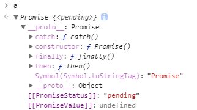

# JavaScript Promise (2)


## Promise 的意義

Promise，如字面的意思就代表 **承諾**。

### 承諾的未來

當你拿到一個 Promise 的時候，代表在未來中這個 Promise 可能會有幾種狀況發生

* 承諾 **被兌現**
* 承諾 **被打破**
* 承諾 **一直沒有回應**

也就是說，承諾代表的不見得是成功。

### 未來之後

而根據這三種結果，我們接下來的動作當然不同

* 承諾被兌現 就 **繼續做預定好的下一件事**
* 承諾被打破 就 **看無法兌現原因 再根據這個原因去做對應的動作**
* 承諾 一直都沒有回應 就 **繼續等下去**

## Promise 的 API


## Promise 測試

Promise 內一定要 `resolve` 或 `reject` 才能往下執行

`resolve` 多次 

`reject` 多次 


```javascript
var a = new Promise(function(resolve, reject) {
			if (true) resolve(123);
		})
console.log(a);		// Promise {<resolved>: 123}
a.then(...)			// can seperate then multiple times
a.then(...)
```


```javascript
var a = new Promise(function(resolve, reject) {
			if (true) reject();
		})
console.log(a);		// Error: Uncaught (in promise)
```


```javascript
var a = new Promise(function(resolve, reject) {
			if (true) return;
		})
console.log(a);		// Promise {<pending>}
```





## then 的測試 & Promise Chain

不用 resolve，因為他不是 Promise

就像在執行一般函式一樣，有回傳東西就會包裹成 Promise，帶到 Promise chain

兩個參數，resolve & reject


```javascript
var a = new Promise(function(resolve, reject) {
			if (true) resolve(123);
		})
.then(getAsyncValueWithPromise)
.then(printValue)
console.log(a);		// Promise {<resolved>: 123}

function printValue(value) {
	console.log('returned value:', value);
}

function getAsyncValue(value) {
  setTimeout(printValue.bind(null, value), 1000);
}

function getAsyncValueWithPromise(value) {
  return new Promise(function(resolve, reject) {
    setTimeout(function() {
    	printValue(value);
        resolve();
    }, 1000);
  })
}
```


## catch

`catch` 是抓整條 chain 上的錯誤，而非單一 promise/then 上的錯誤

抓單一 then 上的錯誤要使用 then 的第二個參數

```javascript
var a = new Promise(function(resolve, reject) {
			if (true) reject('oops');
}).catch(function(e) {
  console.log(e);
})
console.log(a);		// Promise {<resolved>: undefined}
```


## Promise 其他函式

`Promise.resolve()`

`Promise.reject()`

`Promise.race([])`

`Promise.all([])`