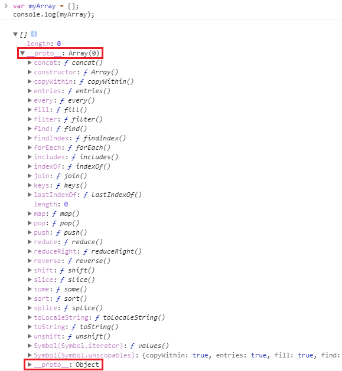
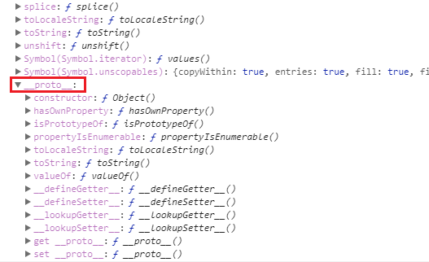

# JavaScript Object oriented (1)

在 JavaScript 中，我們常常依賴型別的內建函式做事，舉陣列當作例子好了，我們常常使用 `forEach`，`find` 等內建函式讓我們可以對 Array 中的每個元素做些操作/檢查的動作。但就像之前所說的，物件就是屬性的容器，那既然都不曾新增過這些函式，為何就可以取用他們呢？是不是其實他們是被藏在哪裡只是我們一直都沒發現而已？


## 查看內建函式

讓我們在空白頁中開啟 Dev Tool 來詳細的觀察一下 Array 吧

```javascript
var myArray1 = [],
    myArray2 = [];
console.log(myArray1);		// []
console.log(myArray2);		// []
```

不意外的，可以看到它們都印出了 `[]`，此時將 `[]` 旁的三角形按下去就可以把更多的內容展開，接著就可以得到下圖：



喔，原來內建函式就是藏在這裡啊，這些內建函式都被放在了 `__proto__` 這個屬性裡面了。在更仔細的往下追，發現其實還有另一個 `__proto__`，旁邊寫著 Object，再把它展開的話，可以得到以下這個樣子：



如果剛剛打開的是 `myArray1` ，現在請再打開 `myArray2` ，可以發現其實兩個的內容都是一樣的。

也就是說，就算我們新增了兩個不同的 Array 物件，這些偷偷藏在內部的東西還是相同的，甚至它再旁邊就清楚著寫著 `__proto__:Array` 跟 `__proto__:Object` 了，就像是在隱喻著我們創建出來的 Array 繼承於 Array 與 Object。這是不是就很像我們常用的物件導向了呢？

現在就讓我們看看要怎麼建立物件導向的程式吧！


## 建構式

如同其他的語言，JavaScript 在建立某個型別的物件之前也需要先有個建構式 (constructor)。還記得之前在 [Function 篇](https://ithelp.ithome.com.tw/articles/10194538) 與 [This 篇](https://ithelp.ithome.com.tw/articles/10196088) 都曾介紹過的 `new` 嗎？

在 JavaScript 中，一個 Function 是不是建構式並不是取決於它的宣告方式，而是取決於它是不是用 `new` 來執行的。如果是用 `new` 執行一個 Function 時，我們就稱做這種呼叫為 **建構式呼叫**。當我們用建構式呼叫去執行一個 Function，這個 Function 就會被當作建構式。

讓我們來舉個例子：

```javascript
function Dog(name) {
  this.name = name;
  this.speak = 'Bark';
  this.move = 'walk';
}
var dog = new Dog('Blacky');
console.log(dog);			// Dog {name: "Blacky", speak: "Bark", move: "walk"}
```

這個範例宣告了一個 Function 叫做 `Dog`，接著我們使用 `new` 來呼叫 `Dog` 這個 Function，也就是要求 JavaScript 為我們建立出一個 `Dog` 子型別的物件。接著再印出新產生出來的物件 `dog`，我們可以看到它就標示著 `Dog {...}` 也就代表這是由 `Dog` 建構式建立出來的。

我們可以把建構式當作是一個 **藍圖**，而經由建構式建立出來的物件就是以藍圖為概念產生的 **產品**。在範例中，`Dog` 就是我們的藍圖，而 `dog` 就是我們經由藍圖產生的產品。

使用 `new` 建構式呼叫的時候，實際上會有幾件事會被執行：

- 首先會新建出一個物件
- 新物件帶有 ` [[Prototype]]` 連結
- 建構式中的 this 會被繫結為此新建物件
- 回傳新建物件 ( 如果建構式本身沒有回傳東西的話 )

其中，1、3、4 點都已經在之前提過，而第 2 點所提的 `[[Prototype]]` 就是讓我們能從物件往上尋找到前面所提的，被 JavaScript 偷偷藏起來的內建函式的一個重要參考，而這個參考並不允許外部存取。更多關於 `[[Prototype]]` 的細節將在之後更詳細的解釋。


## 小結

這一篇中尋找的物件中的內建函式的位置，並開始說明 JavaScript 中要如何建立一個物件導向的程式。

首先我們從建構式開始介紹：

在 JavaScript 中，如果用 `new` 執行一個 Function 時，則這個 Function 就會被當作建構式執行。建構式就好比藍圖，而我們可以用藍圖建立出對應的產品。

另外，當使用 `new` 的時候 JavaScript 會為我們執行以下幾件事情：

- 首先會新建出一個物件
- 新物件帶有 ` [[Prototype]]` 連結
- 建構式中的 this 會被繫結為此新建物件
- 回傳新建物件 ( 如果建構式本身沒有回傳東西的話 )


下一篇中將繼續介紹 JavaScript 物件導向程式。