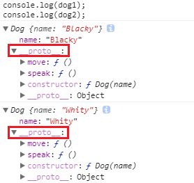

# JavaScript Object-Oriented (2) - 建立共用函式

上一篇中我們提到了如何在 JavaScript 中使用一個建構式以建立出自訂的子型別物件。接下來，如果我們想要讓一個子型別，像 Array、String 等內建子型別一樣有共用函式要怎麼做呢？

### 試圖建立子型別共用函式

相信很多人馬上就想到以下作法：

```javascript
function Dog(name) {
  this.name = name;
  this.speak = function() {
  	console.log('Bark');
  };
  this.move = function() {
  	console.log('walk');
  };
}
var dog1 = new Dog('Blacky'),
    dog2 = new Dog('Whity');
dog1.speak();					// Bark
dog2.speak();					// Bark
```

只要在建構式裡面，對新建的物件加入方法就行啦，這樣我們每次在建構 `Dog` 子型別的時候，建構式就會自動幫我們把共用的函式加上去了。

沒錯，這會是一種解法，也確實每個新建出來的物件都會被加上這個方法，但這個解法有個問題：它並不是真的共用的，這種做法在每次建構時，都特地為物件多加一個一模一樣的屬性上去。如果此時我們大量產生該子型別的物件時，就會浪費許多額外的記憶體空間來存這些重複且相同內容的屬性。


## 使用 Prototype

那撇除以上的方法不談的話，我們還有其他選擇嗎？

有的，使用 Prototype 就可以達成真正的共用函式。

### Prototype

所謂的 Prototype 就是原型，在 JavaScript 中，只要是 **函式上面都有預設有一個公開的 Prototype 屬性**。當我們將一個 Function 當作建構式使用的時候，所有被此建構式新建出來的物件都可以透過 `[[Prototype]]` 參考連結到這個原型物件上來存取其上的屬性。因為每個同子型別物件都能存取其原型物件的屬性，就能讓這些物件 *看起來* 擁有相同的功能，也就可以建立出 *類似物件導向概念* 的程式了。

但還是要再次強調的是，並不像其他的語言一樣會將每個 類別(藍圖) 中的函式、屬性等行為都會被拷貝到每個該類別的物件中。相較之下，JavaScript則是 **所有同樣子型別的物件都會以 `[[Prototype]]` 連結到同一個原型物件，並藉由存取同個原型物件的屬性來假裝這些物件都有相同的行為**。

### 使用 Prototype 建立共用函式

那究竟我們要如何用 Prototype 寫出能夠讓多個物件共用的函式呢？

試著思考以上的說明：**各個同樣子型別的物件都會以 `[[Prototype]]` 連結到同一個原型物件**。也就是說，只要我們為這個原型物件增加屬性，則所有該子型別的物件都可以取用到這個函式，這就是所謂的 共用函式。

```javascript
function Dog(name) {
  this.name = name;
}
Dog.prototype.speak = function() {
   console.log('Bark');
};
Dog.prototype.move = function() {
   console.log('walk');
};
var dog1 = new Dog('Blacky'),
    dog2 = new Dog('Whity');
dog1.speak();					// "Bark"
dog2.speak();					// "Bark"

Dog.prototype.speak = function() {
   console.log('Bow-wow');
};
dog1.speak();					// "Bow-wow"
dog2.speak();					// "Bow-wow"
```

觀察一下範例，我們在 `Dog.prototype` 上面加上了方法，當我們建構式呼叫 `Dog` 創建出 `dog1` & `dog2` 等物件之後，這些物件就可以經由 `[[Prototype]]` 去找到原型物件 `Dog.prototype` 上。執行 `dog1.speak()` 時，由於 `dog1` 本身並沒有 `speak` 方法，因此 JavaScript 會通過 `[[Prototype]]` 去往上查找原型中是否有這個屬性，接著發現，沒錯 `Dog.prototype` 上有個 `speak` 屬性！當然執行後，結果就會印出 `"Bark"` 了。

根據上面的敘述，不管事幾個 `Dog` 子型別的物件，當我們執行 `speak` 的話，其實最後都會連結到同一個原型物件的方法，也就是說今天我們開了一個連鎖寵物店，有 `dog1` ~ `dog1000` 那麼多的狗，他們都還是會連結到同一個 `speak` 方法。

為了證明這點，讓我們試試看直接將 `Dog.prototype.speak` 改成印出 `"Bow-wow"`，看看會不會所有的 `dogX` 的叫聲都變成 `"Bow-wow"`。果然如我們所料，在改完原型函式之後、`dog1` 與 `dog2` 叫聲都變成 `"Bow-wow"` 了！

### \_\_proto\_\_

此時在觀察一下 `dog1` 跟 `dog2` 的物件在我們 Dev Tool 上看起來會長怎麼樣：



啊哈，終於出來了，現在的我們的 `Dog` 子型別物件跟 Array 一樣都有自己的共用函式了。那到底裝載著這些共用函式的 `__proto__` 是什麼呢？

其實 `__proto__` 相當於 `[[Prototype]]`，但因為 `[[Prototype]]` 並不允許外部存取，因此現在的瀏覽器製作了 `__proto__` 當作一個存取的媒介，也就是說只要改變了一個物件中的 `__proto__`就相當於改變了所有物件共用的 `prototype`。

我們也可以比較 `__proto__` 跟 `prototype` 來再次證明先前所講的，所有同子型別物件所取得的原型物件都是同一個這件事：

```javascript
console.log(dog1.__proto__ === Dog.prototype);		// true
console.log(dog2.__proto__ === Dog.prototype);		// true
```

`__proto__` 在 ES6 中成為了標準，但為了效能考量，並不鼓勵使用 `__proto__`，詳情可參考 [MDN](https://developer.mozilla.org/zh-TW/docs/Web/JavaScript/Reference/Global_Objects/Object/proto)。


## 小結

這篇中介紹了 Prototype，以及如何使用 Prototype 建立共用函式。

所謂的 Prototype 就是原型，所有函式上面都有預設有一個公開的 Prototype 屬性，而被此建構式新建出來的物件都可以透過 `[[Prototype]]` 參考連結到這個原型物件上來存取其上的屬性，也就能建立出 *類似物件導向概念* 的程式。

整理一下本篇中出現的名詞：

* `Prototype`：

  也就是原型物件。

  所有函式上面都有預設有一個公開的 Prototype 屬性(原型物件)。被函式建立出的物件都可以存取其對應的原型物件。

* `[[Prototype]]`：

  用來讓物件能夠連結到其原型物件上的一個參考。

  這是一個不允許外部存取的屬性。

* `__proto__`：

  相當於可存取的 `[[Prototype]]`，為了方便存取 `Prototype` 而生。

  雖已於 ES6 中列為標準，但為了效能考量還是不建議使用。


## 參考

[You Don't Know JS: this & object prototypes](https://github.com/getify/You-Dont-Know-JS/tree/master/this%20%26%20object%20prototypes)

[飛肯設計: 進階 JS 班](http://www.flycan.com.tw/course/course-javascript-adv.php)