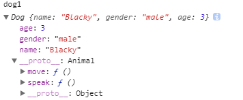
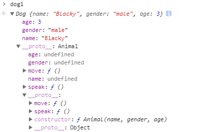

# JavaScript Object-Oriented (3) - inheritence

到目前為止，我們已經介紹了如何新建同個子型別的物件，以及如何讓這些物件都可能共有相同的函式。現在，我們的 JavaScript 物件導向程式已經有一個雛型了。

有了原型以及物件，接下來當然就會想要邁入物件導向的另一個重點：繼承。

同樣的，在試圖達成任何事情之前都要先搞懂目標以及問題點在哪，在釐清之後，再去思考可能的解答。因此，讓我們推理一下要如何去達成 JavaScript 的繼承吧！

## 推理

現在，我們的目標就是要達成繼承。那要搞懂怎麼實作繼承之前，當然需要先了解到底甚麼是繼承。

簡單來講，繼承就是 `is a` 的關係。像是 `Dog is an Animal `，又或者像是 `Car is a Vehicle`。

拿 `Dog is an Animal` 來討論，`Dog` 是我們的子類別，而 `Animal` 是我們的父類別。由於子類別也是一種基底類別，因此父類別會有的功能，子類別都要有 。讓我們照樣造句一下：只要是 `Animal` 都會進食，而因為 `Dog` 也是一種動物，所以 `Dog` 也必定會進食。

那這時我們的實作重點就很明確了，就是 *父類別的功能子類別都要有*。

就讓我們用 JavaScript 的名詞來整理一下重點：

* **目標：**

  達成繼承


* **實作方向：**

  子原型物件要有所有父原型物件的屬性

就讓我們朝以上的方向前進吧！

## 錯誤的繼承

```javascript
Dog.prototype = Animal.prototype;
```

相信很多人的直覺就是認為，既然 子原型物件要有所有父原型物件的屬性，那就把 `Dog.prototype` 先變成 `Animal.prototype` 就好啦。可惜這次錯誤的想法，讓我們看一下為甚麼會錯：

```javascript
function Animal(name, gender, age) {
  this.name = name;
  this.gender = gender;
  this.age = age;
}
Animal.prototype.speak = function() {
  console.log('some sounds');
};
Animal.prototype.move = function() {};


function Dog(name, gender, age) {
  this.name = name;
  this.gender = gender;
  this.age = age;
}
Dog.prototype = Animal.prototype;
Dog.prototype.speak = function() {
   console.log('Bow-wow');
};
Dog.prototype.move = function() {
   console.log('walk');
};


var dog1 = new Dog('Blacky', 'male', 3),
    dog2 = new Dog('Whity', 'female', 1),
    animal = new Animal('Browny', 'male', 5);
dog1.speak();					// "Bow-wow"
dog2.speak();					// "Bow-wow"
animal.speak();					// "Bow-wow"
```

現在我們有兩個建構式：`Animal` 跟 `Dog` 。接著最重要的地方來了就是 `Dog.prototype = Animal.prototype;`。

現在我們把 `Dog` 原型物件的內容變成 `Animal` 的原型物件了，這確實達成了 *子原型物件要有所有父原型物件的屬性* 這個重點，但實際上，我們改動的結果不會是我們想要的。

讓我們往範例下面繼續看：拿到了父原型物件 `Animal` 的屬性後，我們接著把這些屬性特化為子物件 `Dog` 的行為 ，像是 `Dog` 的叫聲會是 `Bow-wow`。

然後我們就會發現結果跟我們想的不一樣，雖然現在每個 `dog.speak()` 的叫聲都會是 `"Bow-wow"`，但是我們發現連 `Animal` 的叫聲都會變成 `"Bow-wow"`，今天假如還要一個 `Cat` 物件，那他可能就要學狗叫了！

`Animal` 也會被覆蓋的原因是因為 `Dog.prototype = Animal.prototype;` 的關係。因為 Call by Sharing 的緣故，你只要修改了 `Dog.prototype` 就等於修改了 `Animal.prototype`。

這個方法行不通，但失敗為成功之母，我們知道不行直接修改到 `Animal.prototype`，而是應該要拷貝一份與 `Animal.prototype` 相同內容的物件後，指派給 `Dog.prototype`。

## 正確的繼承

### Object.create

```javascript
Dog.prototype = Object.create(Animal.prototype);
```

這就會是我們想要的解法了。`Object.create` 會回傳與一個原型物件相同的新物件回來，因此就不會出現改到 `Animal.prototype` 的問題了。我們的完整範例會如下：

```javascript
function Animal(name, gender, age) {
  this.name = name;
  this.gender = gender;
  this.age = age;
}
Animal.prototype.speak = function() {
  console.log('some sounds');
};
Animal.prototype.move = function() {};


function Dog(name, gender, age) {
  this.name = name;
  this.gender = gender;
  this.age = age;
}
Dog.prototype = Object.create(Animal.prototype);
Dog.prototype.speak = function() {
   console.log('Bow-wow');
};
Dog.prototype.move = function() {
   console.log('walk');
};


var dog1 = new Dog('Blacky', 'male', 3),
    dog2 = new Dog('Whity', 'female', 1),
    animal = new Animal('Browny', 'male', 5);
dog1.speak();					// "Bow-wow"
dog2.speak();					// "Bow-wow"
animal.speak();					// "some sounds"
```

現在，我們可以不強制每個 `animal` 都學狗叫了。此時 `dog` 內容會如圖所示：



終於，我們成功繼承了 `Animal` 的內建方法！


## 小結

這次我們介紹了如何利用 JavaScript 實現繼承原型。

JavaScript 實現繼承原型的重點在於，子原型物件要有所有父原型物件的屬性，而使用 `derived.prototype = Object.create(base.prototype)` 可以達成我們的目的。


## 參考

[You Don't Know JS: this & object prototypes](https://github.com/getify/You-Dont-Know-JS/tree/master/this%20%26%20object%20prototypes)

[飛肯設計: 進階 JS 班](http://www.flycan.com.tw/course/course-javascript-adv.php)


### setPrototypeOf

```javascript
Dog.prototype = Object.setPrototypeOf(Dog.prototype, Animal.prototype);
```


### 修改完成後

```javascript
function Animal(name, gender, age) {
  // throw error
  this.name = name;
  this.gender = gender;
  this.age = age;
}
Animal.prototype.speak = function() {
  console.log('some sounds');
};
Animal.prototype.move = function() {};

function Dog(name, gender, age) {
  Animal.apply(this, arguments);
  // this.xxx
}
Dog.prototype = Object.create(Animal.prototype);
Dog.prototype.speak = function() {
   console.log('Bow-wow');
};
Dog.prototype.move = function() {
   console.log('walk');
};
var dog1 = new Dog('Blacky', 'male', 3),
    dog2 = new Dog('Whity', 'female', 1),
    animal = new Animal('Browny', 'male', 5);
dog1.speak();					// "Bow-wow"
dog2.speak();					// "Bow-wow"
animal.speak();					// "Bow-wow"
```


`__proto__`


因此看看 `dog2.speak()`，


Prototype 適用狀況


### 繼承屬性

```javascript
function Dog() {
  Animal.apply(this, arguments);
  // this.xxx
}
```


### 繼承原型方法

### new

```javascript
Dog.prototype = new Animal();
```




prototype vs proto


## Where are Built in function & properties?

has own property


## Get & Put


## Prototype Chain

rules

end of prototype chain


## constructor and 藍圖


## Prototype & proto

prototypes are object

only function has prototype


## Inherit from prototype