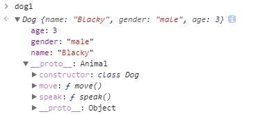

# JavaScript Object-oriented (4) - With ES6

到上一篇為止，我們已經學會了如何使用 JavaScript 的 Prototype 寫出類似物件導向的程式。雖然如此，但是 Prototype 的繼承寫法會讓人無法一目了然。

在 ES6 中允許我們以更貼近物件導向的語法來寫，雖然基底依然還是 Prototype，但可以有效增加開發速度以及易讀性。


## ES6 物件導向寫法

就讓我們把之前的 `Animal` 與 `Dog` 改成 ES6 寫法吧：

```javascript
class Animal {
  constructor(name, gender, age) {
    this.name = name;
  	this.gender = gender;
  	this.age = age;
  }
  speak() {
  	console.log('some sounds');
  }
  move() {}
}

class Dog extends Animal {
  constructor(name, gender, age) {
    super(name, gender, age);
  }
  speak() {
  	console.log('Bow-wow');
  }
  move() {
    console.log('walk');
  }
}

var dog1 = new Dog('Blacky', 'male', 3),
    dog2 = new Dog('Whity', 'female', 1),
    animal = new Animal('Browny', 'male', 5);
dog1.speak();					// "Bow-wow"
dog2.speak();					// "Bow-wow"
animal.speak();					// "some sounds"
```

經由範例，我們可以看到解答是一樣的，接下來就讓我們來看看 ES6 的物件導向程式是由什麼構成的

### 類別宣告

ES6 的類別宣告可以不使用 `new` 建構式呼叫 Function 來產生新物件，直接使用

```javascript
class NameOfClass {
  // ...
}
```

就可以宣告類別。

### 建構式

ES6 物件導向語法特地將 類別宣告 跟 建構式 是分開的。

現在在類別中加上 `constructor()` 函式就相當於宣告此類別的建構式

```javascript
class NameOfClass {
  constructor(arguments) {
	//...
  }
  // ...
}
```

### 定義行為

定義 方法(行為) 的方式與定義 建構式 的方式大同小異，只要在類別中加上 `方法名() {}` 就可以定義方法了

```javascript
class NameOfClass {
  constructor(arguments) {
	//...
  }
  method() {
    // ...
  }
  // ...
}
```

### 繼承

只要在宣告子類別時加入 `extend` 就可以讓子類別 要繼承 父類別：

```javascript
class Dog extends Animal {
	// ...  
}
```

* **呼叫父類別建構式**

  如果此時要使用父類別的建構式的話，只要呼叫 `super(arguments)`即可，如下：

  ```javascript
  constructor(arguments) {
    super(arguments);
  }
  ```

  而在 ES5 時，我們則要以 `Animal.apply(this, arguments);` 這種較不直觀的方式才能呼叫父類別建構式。

* **呼叫父類別方法**

  同樣的，如果要使用父類別方法的話，只要呼叫 `super.method(arguments)`即可，如下：

  ```javascript
  method(arguments) {
    super.method(arguments);
  }
  ```

  ### 

### 物件內容

最後來看看透過 ES6 語法建立出來的物件內容會是怎麼樣：



可以發現物件內容與利用 Prototype 實作物件導向的結果是一樣的，`Dog` 型別依然是透過 `__proto__` 連結到 `Animal` 的，也就是說就算 ES6 把物件導向語法包裹的更像一般的類別，他的基底依然是透過 Prototype 去實作的，因此了解 Prototype 的運作原理還是有其價值所在。


## 小結

本篇介紹了 ES6 的物件導向語法，這種語法可以有效的增加開發速度以及易讀性，然而不論是採用 ES5 還是 ES6 ，實作出來的物件內容都一樣是 Prototype 的結構，因此詳細了解 Prototype 的運作原理還是有其價值所在。


## 參考

[飛肯設計: 進階 JS 班](http://www.flycan.com.tw/course/course-javascript-adv.php)


還是 Prototype Based

學習 Prototype 還是有用處