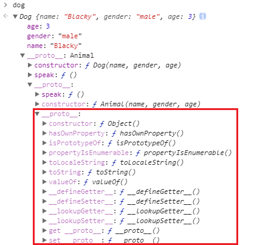

# JavaScript Prototype Chain

在之前的篇章裡已經詳細的介紹過要如何建立 JavaScript 的物件導向程式，然而我們尚未好好的看過整個全局

為什麼這麼說呢？讓我們回到 `Animal` 與 `Dog` 的範例


## 範例回顧

為了方便了解 prototype，我們先不採用 ES6 的物件導向語法糖實作：

```javascript
function Animal(name, gender, age) {
  this.name = name;
  this.gender = gender;
  this.age = age;
}
Animal.prototype.speak = function() {
  console.log('some sounds');
};


function Dog(name, gender, age) {1
  this.name = name;
  this.gender = gender;
  this.age = age;
}
Dog.prototype = Object.create(Animal.prototype);
Dog.prototype.constructor = Dog;
Dog.prototype.speak = function() {
   console.log('Bow-wow');
};


var dog = new Dog('Blacky', 'male', 3);
dog.speak();							// "Bow-wow"
dog.hasOwnProperty('name');			// "Bow-wow"
```

有沒有發現我們竟還還有一個 `hasOwnProperty` 方法，但明明都沒有定義過啊！？

讓我們思考一下 `dog` 的型別是什麼：

* **Dog**

  當然是，畢竟 `dog` 是由 `new Dog()` 建構式產生的。

* **Animal**

  也是，因為 `Dog.prototype` 的 `[[Prototype]]` 會連結到 `Animal.prototype`。

* **Object**

  依然是，還記得我們曾說過：[JavaScript 中除了原始型別以外的一切都是物件](https://ithelp.ithome.com.tw/articles/10192598)嗎？`dog` 不是原始型別，所以他一定是物件。

因此我們的答案是以上皆是。

那 `hasOwnProperty` 這個方法是哪來的就呼之欲出了，既然我們在 `Dog` 跟 `Animal` 都沒定義過 `hasOwnProperty`，那他必然就是 `Object` 的內建屬性了。

現在就讓我們把 `dog` 所有的 `__proto__` 連結展開看看 `hasOwnProperty` 藏在哪：



找到了！跟我們預想的一樣，`hasOwnProperty` 就是 `Object` 的方法。

那就讓我們詳細了解一下 JavaScript 尋找屬性的規則：Prototype Chain 吧

### Prototype Chain

#### 意義

JavaScript 屬性查找的機制。

#### 規則

在了解規則前我們要先意識到，**所有物件的最基層原型物件都會是 `Object.prototype`** ，因為只要不是原始型別，都會是屬於物件的子型別。

接著了解了這個的前提下，就讓我們來看看規則吧：

* 讀取規則
  * 尋找該物件上是否有目標屬性
  * 沒有就透過 `[[Prototype]]` 上層原型物件查找，找到同名屬性就回傳該屬性
  * 直到 `Object.prototype` 都沒找到就回傳 `undefined`
* 寫入規則
  * 尋找該物件與其 `[[Prototype]]` 上的原型物件是否有同名屬性，發現的話
    * 如果該屬性的 `writable` 為 `true`，就寫入
    * 如果該屬性的 `writable` 為 `false`，就不寫入
  * 直到 `Object.prototype` 都沒找到就寫入屬性到該物件

#### 遮蔽

在讀取屬性的規則中可以看到，Prototype Chain 與 Scope 查找機制很像，JavaScript 依然會以從物件開始往上層物件尋找，也就是只要找到最距離接近物件的屬性就會取用該屬性。

後面原型物件的屬性雖然還存在，但就不會被拿來使用了，這就是 Prototype Chain 的遮蔽特性。**有了 Prototype Chain 的遮蔽特性，我們才能複寫父類別方法來仿造物件導向的繼承概念**。

#### 範例

舉例來說，當範例中呼叫

```javascript
dog.speak();
```

JavaScript 會發現 `dog` 上根本沒有 `speak` 這個方法 (如圖，只有 `age`、`gender`、`name` 三個屬性)，因此就會往他的 `[[Prototype]]` 上的  `Dog.prototype` 查找。在 `Dog.prototype` 馬上發現 `speak` 方法，因此就停止查找，取用該方法。

也就是說雖然 `Animal.prototype.speak` 這個方法依然存在，但是因為優先查找到 `Dog.prototype.speak` 所以被遮蔽掉了，因此我們執行 `dog.speak()` 的結果才會是印出 `"Bow-wow"`。


## 小結

這篇中我們學到了 Prototype Chain 的規則，主要有幾個重點：

* **所有物件的最基層原型物件都會是 `Object.prototype`**

- 讀取規則
  - 尋找該物件上是否有目標屬性
  - 沒有就透過 `[[Prototype]]` 上層原型物件查找，找到同名屬性就回傳該屬性
  - 直到 `Object.prototype` 都沒找到就回傳 `undefined`
- 寫入規則
  - 尋找該物件與其 `[[Prototype]]` 上的原型物件是否有同名屬性，發現的話
    - 如果該屬性的 `writable` 為 `true`，就寫入
    - 如果該屬性的 `writable` 為 `false`，就不寫入

因為這個特性，因此**子類別屬性會遮蔽父類別屬性**，這也是我們能寫出仿物件導向繼承的重要原因之一。


## 參考

[You Don't Know JS: this & object prototypes](https://github.com/getify/You-Dont-Know-JS/tree/master/this%20%26%20object%20prototypes)