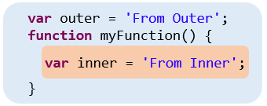
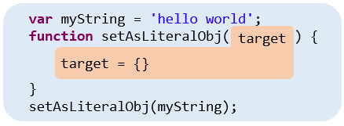
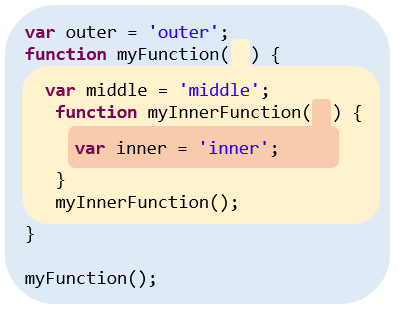

# JavaScript Lexical Scope

何謂 Scope 呢? 簡單來講就是

*規範哪些變數在哪些程式碼中可以取用的規則*

Scope 主要分成兩種類型：

* Lexical Scope ( 語彙範疇 )
* Dynamic Scope ( 動態範疇 )

JavaScript 與大多數的語言相同是採用 Lexiacal Scope。以下讓我們來介紹 **Lexical Scope ( 語彙範疇 )**


## Lexical Scope ( 語彙範疇 )

代表著區塊間的包裹關係，**被包裹在內層的區塊可以保護自己的變數不被外層取用，相反的外層區塊的變數還是可以被內層區塊使用**。

這麼講可能很抽象，那就讓我們來看看範例：

```javascript
var outer = 'From Outer';
function myFunction() {
  var inner = 'From Inner';
  console.log(outer);				// "From Outer"
  console.log(inner);				// "From Inner"
}
console.log(outer);					// "From Outer"
console.log(inner);					// Uncaught ReferenceError: inner is not defined
```

`myFunction` 包裹出一個 `{}` 區塊，並在內部新宣告了一個變數 `inner`。`inner`可以在 `myFunction` 區塊裡的被取用，然而當 `myFunction` 區塊的外面試圖取用 `inner` 時，就會發生 `Uncaught ReferenceError: innerVar is not defined` 的錯誤。

再回過頭來看 `outer`。`outer` 是外層區塊宣告的變數，因此不論是 `myFunction` 的內層區塊還是 `outer` 自己所在的外層區塊，都是可以取用到 `outer` 的。

讓我們將這段程式碼換成更容易理解的圖：



圖中的橘色區塊中宣告的變數無法被藍色區塊取用

再讓我們複習一次：**被包裹在內層的區塊可以保護自己的變數不被外層取用，相反的外層區塊的變數還是可以被內層區塊使用**。


### 參數也屬於內層 Scope

還記得 [JavaScript 傳值篇](https://ithelp.ithome.com.tw/articles/10194299)所講的，當參數傳遞進 Function 的時候，會先將內容指派給一個新的變數：

```javascript
var myString = 'hello world';
function setAsLiteralObj(target) {
	target = {};
}
setAsLiteralObj(myString);
console.log(myString);					// 'hello world'
console.log(target);					// Uncaught ReferenceError: target is not defined
```

執行 `setAsLiteralobj(myString);` 時， `myString` 會將記憶體位置指派給 `function` 中的新參數 `target`，我們可以把他理解成：

```javascript
var target = myString;
```

也就是 `target` 是在執行 `setAsLiteralObj` 時才會新建的參數，這個新建的變數也是屬於 `setAsLiteralObj ` 函式區塊的，所以試圖在外層印出 `target` 時，才會得到 `Uncaught ReferenceError: target is not defined` 的錯誤訊息。

為了改正我們的觀念，應該把泡泡圖改成這樣：



### 巢狀 Scope

當我們有區塊包裹著區塊時，就會出現巢狀 Scope：

```javascript
var outer = 'outer';
function myFunction() {
  var middle = 'middle';
  function myInnerFunction() {
    var inner = 'inner';
  }
  myInnerFunction();
}

myFunction();
```

規則也是同樣的：**外層 Scope 無法取用內層變數，但內層 Scope 可以取用外層變數**




### 編寫時期就決定好

從上面的說明，我們不難發現，Lexical Scope 是在程式編寫時就決定好了，因為區塊的擺放位置是我們在寫程式的時候決定，而不是 JavaScript 的編譯器為我們產生的。

再更進一步思考就是，**在編寫時期我們就可以決定哪個變數在哪些地方可以被取用**，這是要建立易於維護的程式碼時必須要有的基本認知。


## 小結

本篇主要介紹 Lexical Scope

**Scope 主要分成兩種類型：**

- Lexical Scope ( 語彙範疇 )
- Dynamic Scope ( 動態範疇 )

而 JavaScript 是採用 Lexical Scope ( 語彙範疇 )

**Lexical Scope 代表著區塊間的包裹關係**，他的規則是：

* 外層 Scope 無法取用內層變數，但內層 Scope 可以取用外層變數

**Lexical Scope 是在程式編寫時就決定好了**，因為區塊的擺放位置是我們在寫程式的時候就決定好了，這代表著在**編寫時期我們就可以決定哪個變數在哪些地方可以被取用**，這是要建立易於維護的程式碼時必須要有的重要觀念。


## 參考

[You Don't Know JS: Scope & Closure](https://github.com/getify/You-Dont-Know-JS/tree/master/scope%20%26%20closures)
