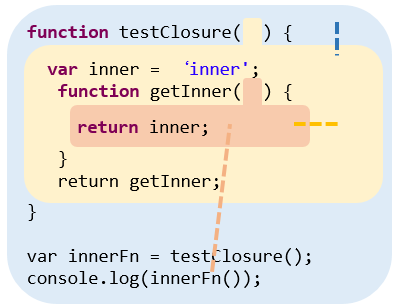

# JavaScript Closure

我想 Closure 應該算是讓初學者進入 JavaScript 對難理解確也是最重要的一個概念，想當初剛開始學習 JavaScript 的時候，看到 Function 中又可以再宣告 Function，只覺得一片混亂而已。

Function 中為何能再宣告 Function 這點已經在 [函式篇](https://ithelp.ithome.com.tw/articles/10194538) 介紹過，接下來，我們將利用累積下來的 Function 與 Scope 概念去挑戰 Closure。


## Closure 範例

***能夠傳遞 Scope，並允許 Scope 在原有位置以外取用的能力即為 Closure***

首先讓我們看看範例：

```javascript
function testClosure() {
  var inner = 'inner';
  function getInner() {
    return inner;
  }
  return getInner;
}

var innerFn = testClosure();
console.log(innerFn());			// inner
```

有看出 `console.log(innerFn())` 的答案是 `"inner"` 嗎？

現在你可能覺得理所當然，又或者不知所措，無論如何，讓我們看看這個範例程式裡有哪些特殊的地方：

### 巢狀 Scope

到了複習的時刻了

- **回想一下 JavaScript 中，[產生 Scope 最常見的單位](https://ithelp.ithome.com.tw/articles/10194869) 是什麼？**

  能產生 Scope 最常見的單位是 Function，Function 在執行後就會產生 Scope

- **[巢狀 Scope](https://ithelp.ithome.com.tw/articles/10194869) 是什麼意思？**

  顧名思義，就是一層一層 Scope 包裹下去，就會是 巢狀 Scope。再結合上一題的答案，我們可以用更準確的方法說明：

  ***當 Function 包裹住 Function，則在這些 Function 被執行的時候，就會產生 巢狀 Scope***

**範例中的巢狀 Scope：**因為函式 `testClosure` 包裹著函式 `getInner`。而在 `getInner` 被執行後，就產生了巢狀 Scope。

因此，如果 `testClosure` 與 `getInner` 都被執行的話，我們就會得到以下的泡泡圖：



### 傳遞了被包裹的 Function

- **再回想一下，[Function 為什麼能夠被傳遞](https://ithelp.ithome.com.tw/articles/10194538)？**

  因為 Function 是 JavaScript 的 First-class Object，也就是 Function 跟 Object 一樣是能被傳遞的。

**範例中的 Function 被傳遞了：**執行 `testClosure` 後，函式 `getInner` 被回傳了，並指派給外部的變數 `innerFn` ( `var innerFn = testClosure();` )。

接下來就是 Closure 最後，也是最重要的一部分了。

### 被傳遞的 Function 在原有的 Scope 以外被執行

**範例中被傳遞的 Function 在原有的 Scope 以外被執行：**`getInner` 被指派給 `innerFn` 之後，隨即就被 `console.log(innerFn())` 執行。此時 JavaScript 發現 `getInner`，要取用他的父層 Scope `testClosure` 的變數 `inner`，因此就回傳並且印出 `"inner"`，這正是我們的答案。

發現一個很特別的地方了嗎？`testClosure` 明明已經執行完了，理應 `testClosure` 產生的 Scope 就會被消滅了，但實際上，內部 Function `getInner` 傳遞給外部變數 `innerFn` 後，`testClosure` 產生的 Scope 卻沒有被消滅，除此之外，`getInner` 的 Scope 竟然還能透過 [Scope 查找](https://ithelp.ithome.com.tw/articles/10194869) 往上找到變數 `inner`。

這就是我們能夠使用 Closure 的一個最重要的原因：**就算是 Funciton 已經執行完畢了，只要內部有 Function 被傳遞到其他地方，JavaScript 還是會保留這個 Scope，之後當內部 Function 被執行時，就能透過 Scope 查找往上找到外層 Scope**。


綜合以上，我們才說 **Closure 就是能夠傳遞 Scope，並允許 Scope 在原有位置以外取用的能力**。


## 小結

Closure 是 **允許 Scope 在原有的位置以外被取用** 的能力

而觀察到 Closure 有幾個條件：

- 有巢狀 Scope 的存在
- 傳遞了被包裹的 Function
- 被傳遞的 Function 在原有的 Scope 以外被執行

藉由這樣，我們才能在外部的 Scope，查找被包裹的 Function 的外層 Scope 環境


## 參考

[You Don't Know JS: Scope & Closure](https://github.com/getify/You-Dont-Know-JS/tree/master/scope%20%26%20closures)