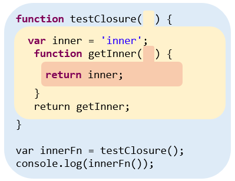

# JavaScript Closure

我想 Closure 應該算是讓初學者進入 JavaScript 對難理解確也是最重要的一個概念，想當初剛開始學習 JavaScript 的後，看到 Function 中又可以再宣告 Function，只覺得一片混亂而已。

Function 中為何能再宣告 Function 這點已經在 [函式篇](https://ithelp.ithome.com.tw/articles/10194538) 介紹過，接下來，我們將利用累積下來的 Function 與 Scope 概念去挑戰 Closure。


## Closure 是什麼

實際上的重點就只是多了一個傳遞 Scope 的能力，再利用 Scope Lookup 去查找被傳遞 Function 的 parent scope 的內容

看的到目前 Scope 看不到的內容

在外部執行 Scope


```javascript
function testClosure() {
  var inner = 'inner'
  function getInner() {
    return inner;
  }
  return getInner;
}

var innerFn = testClosure();
console.log(innerFn());			// inner
```


圖




定義


觀察到的條件


Closure 無處不在


範例：setTimeout, for


Closure 的空間問題


傳遞 Scope 能達成的黑魔法：模組，附註可以參考 You don't know JS