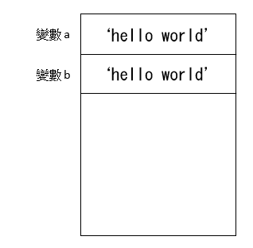

# JavaScript 參數傳遞方式

JavaScript 中，很多人認為 原始型態是透過 Call by value，而物件型態是透過 Call by Reference，但實際上是如何呢? 

本篇我們會先介紹各種語言中常見的三種參數傳遞方式，有了這些基礎概念，我們才能深入探討 JavaScript 的內部運作原理。

## 三種參數傳遞方式

### Call by value

變數中內存值，當要把值指派給另一個變數時，**指派變數 會將值複製給 被指派變數**，因此兩個變數內容的值相同，但是記憶體位置是不同的。

#### 範例

- **兩個主角：** 變數 `a` & 變數 `b`

- **故事：**將變數 `a` 指派給一個 新變數 `b` ( var b = a )

- **記憶體內容：**

  1. 一開始只有一個變數 `a`，其中的內容為 `hello world`
    

  2. 變數 `a` 指派內容給變數  `b`

     變數 `b` 會被分配到一個新的記憶體位置，其中的內容也是 `hello world`
       

### Call by reference

變數中內存值，當要把值指派給另一個變數時，**被指派變數 被設為 指派變數記憶體位置的別名**，因此兩個變數代表相同的記憶體位置

#### 範例

- **兩個主角：**變數 `a` & 變數 `b`

- **故事：**將變數 `a` 指派給一個 新變數 `b` ( var b = a )

- **記憶體內容：**

  1. 一開始只有一個變數 `a`，其中的內容為 `hello world`
     

  2. 變數 `a` 指派內容給變數  `b`

     變數 `b` 被設為 變數 `a` 的別名
     

### Call by sharing

類似 C++ 中的指標。

變數中內存值的記憶體位置，當要把值指派給另一個變數時，**指派變數 將記憶體位置複製給 被指派變數**，因此兩個變數**指向**相同的記憶體位置

嚴格來說 Call by sharing 其實是 Call by value，只是 value 是記憶體位置而不是實際內容

#### 範例

- **兩個主角：**變數 `a` & 變數 `b`

- **故事：**將變數 `a` 指派給一個 新變數 `b` ( var b = a )

- **記憶體內容：**

  1. 一開始只有一個變數 `a`，其中儲存的內容為 `hello world` 的記憶體位置 (不是直接存 `hello world` 這個值)
     

  2. 變數 `a` 指派內容給變數  `b`

     變數 `b` 會被分配到一個新的記憶體位置，裡面也是儲存為 `hello world` 的記憶體位置
     

## 小結

在本篇中，介紹了三種常見的參數傳遞方式 `call by value`，`call by reference`，`call by sharing`。

下一篇，我們會介紹 JavaScript 是以哪個參數傳遞方式實作的。

## 參考

http://wp.mlab.tw/?p=176

https://www.slideshare.net/YiTaiLin/java-script-63031051

[保哥 JavaScript 開發實戰：核心概念篇](https://www.accupass.com/event/1710170207181263097416)