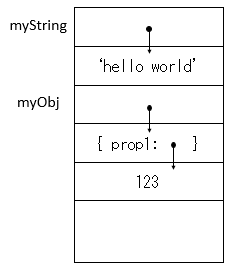
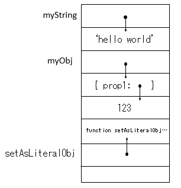
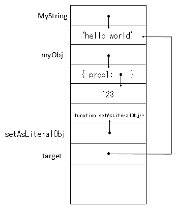
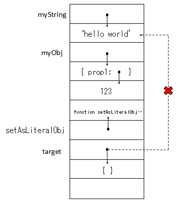
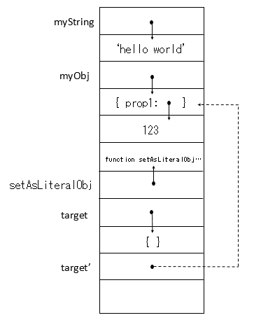
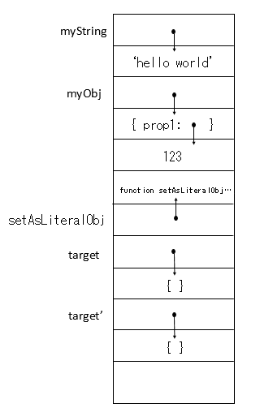
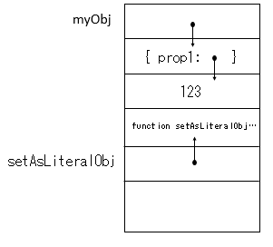
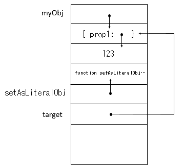
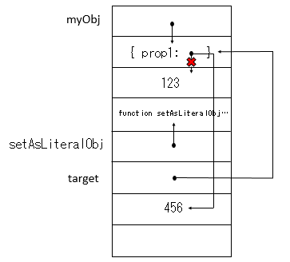

# JavaScript 參數傳遞方式 (2)

在上一篇中，我們介紹了三種常見的參數傳遞方式：Call by value、Call by reference、Call by Sharing

那究竟 JavaScript 是採用何種參數傳遞策略呢? 本篇將對這點詳細的介紹。


## JavaScript 參數傳遞方式

答案：**很有可能是 Call by sharing**。

為何說是很可能呢? 我們要知道 [ECMAScript](https://www.ecma-international.org/ecma-262/) 是 JavaScript 這項語言的規範，因此不論瀏覽器採用何種做法，只要他們符合 [ECMAScript](https://www.ecma-international.org/ecma-262/) 就可以算是合格的 JavaScript 編譯器了。但他們有很大的機會是以 Call by sharing 的方式實作的，因為 Call by sharing 可以很合理的解釋 JavaScript 中的各種參數傳遞行為。

接下來我們會以 Call by sharing 的觀點來看 JavaScript 的傳值行為。

### 變數、物件、屬性 與記憶體位置

在 Call by sharing 的概念中，變數、物件、屬性 都是容器，那他們分別裝甚麼呢?

- **變數：** 儲存內容的記憶體位置 ( 參考 [JavaScript - 參數傳遞方式 (1)](https://ithelp.ithome.com.tw/articles/10194109) )
- **物件：** 儲存物件中的每個屬性
  - **屬性：** 儲存屬性 key 的值 & 儲存屬性 value 的記憶體位置

接下來，我們就先來介紹常常使用的字面值，底層的記憶體位置是如何運作的。

### 字面值 與記憶體位置

首先我們要認清得一件事是，字面值代表的是一個內含值的新記憶體空間。

```javascript
var myString = 'hello world',
    myObj = { prop1: 123};
```

以 Call by sharing 解釋這個範例的記憶體位置，其示意圖會如下圖所示：



這張圖畫出了 變數、物件、屬性在記憶體位置中的角色。變數 & 屬性都指向各自內容的記憶體位置，而屬性其實則被儲存在物件的記憶體位置中。

接著我們用這個概念來看看原始型別的參數傳遞。

### 原始型別參數傳遞類似 Call by value?

許多人認為 原始型別是 Call by value ，但有這個認知是因為原始型別變數必須要透過 字面值 才能被覆蓋成其他原始型別內容。這呼應了 [原始型別篇](https://ithelp.ithome.com.tw/articles/10192598) 所說的：

> 原始型別是不可變異的(immutable)，因為 JavaScript 中並沒有任何的語法/手段能改變原始型別的記憶體內容。

我們能改變的其實只有變數指向的內容而已。

讓我們來看看範例：

```javascript
var myString = 'hello world',
    myObj = { prop1: 123 };
function setAsLiteralobj(target) {
	target = {};
}
setAsLiteralobj(myString);
console.log(myString);					// 'hello world'
setAsLiteralobj(myObj);
console.log(myObj);						// { prop1: 123 }
```

如我們預期的，原始型別 `myString` 傳遞給 `target` 的結果跟我們所想的 Call by value 的行為相同，但為何連 `myObj` 這個物件型別也會有 Call by value 的行為呢?

讓我們來細細解讀其中的記憶體位置：

1. 直接跳到宣告完 `function setAsLiteralobj` 後的記憶體位置狀況：

   可以看到 `setAsLiteralObj` 其實被當作是一個變數，指向 `function setAsLiteralObj` 的內容 ( 將在下一篇中講解 ) 

  

2. 執行 `setAsLiteralobj(myString);` 時，首先 `myString` 會將記憶體位置指派給 `function` 中的新參數 `target`，我們可以把他理解成

   ```javascript
   var target = myString;
   ```

   因此記憶體位置會變成 `myString` 與 `target` 都指向同一個位置：

   

3. 在 `target = {};` 述句，`target` 被透過字面值賦予 `{}` ，所以 `target` 從原本指向 `'hello world'` 改成指向我們剛創造出來的 `{}`：

   

4. `setAsLiteralobj(myObj);` 也是一樣的概念，`myObj` 會被指派給 `function` 的參數 `target`。這邊要注意的是，此 `target` 與執行 `setAsLiteralobj(myString);` 時的 `target` 是不同的，以下我們以 `target'` 表示新的參數。記憶體位置會變成這樣：

   

5. 在 `target = {};`，`target'` 被賦予 `{}` 字面值，因此原來 `target'` 從原本指向 `{ prop1: 123 }` 改成指向我們剛創造出來的 `{}` 位置。

   

   結果就會是 `myString` 與 `myObj` 依然指向原來的記憶體物件，而這些記憶體物件的內容都沒有被改變，改變的只有 `target` & `target'` 指向的記憶體位置而已。

從範例中我們可以看到，其實**不論是原始型別還是物件，只要是字面值，其實做的都不是參數傳遞，而是賦予新值。**而只要是賦予新值，就會讓人產生是 Call by value 的錯覺，但實際上他還是 Call by sharing。

### 物件參數傳遞類似 Call by reference?

許多人會有 物件是 Call by reference 的觀念，其實是因為我們通常都是對屬性指派字面值，而不是對物件本身指派。但事實上，如同上一點所提到的，只要是賦予字面值，即便是物件也不會有 Call by reference 的行為。

那為什麼只對屬性指派字面值會讓物件有類似 Call by reference 的效果呢? 現在讓我們用 Call by sharing 來解釋以下的範例：

```javascript
var myObj = { prop1: 123 };
function setAsLiteralobj(target) {
	target.prop1 = 456;
}
setAsLiteralobj(myObj);
console.log(myObj);						// { prop1: 456 }
```

從答案 `myObj` 的值為 ` { prop1: 456 }` 這點來看，這確實是 Call by reference 的行為。但實際上發生的情形又是如何呢?讓我們來了解一下：

1. 跳到宣告完 `function setAsLiteralobj` ，記憶體位置狀況如下：



2. 進入 `setAsLiteralobj ` 時，`myObj` 將 `{ prop1: } `記憶體位置複製給 `target`，現在 `myObj` 與 `target` 都指向 `{ prop1: }`



3. `target.prop1 = 456;` 讓 `prop1` 不再指向 `123`，而改指向 `456`，因此最終結果會如下圖所示：



結果是，`myObj` 與 `target` 依然同時指向 `{ prop1: }` ，有改變的只是 `prop1` 指向的位置改指向 `456` 而已，因此理所當然的，`myObj` 那到的值會是 `{ prop1: 456 }`。

從這範例中可以知道，**改變屬性的內容並不會改變變數指向的位置**，因此才會讓人覺得物件的參數傳遞是採用 Call by reference，但實際上，這更有可能是 Call by sharing 的行為。


## 小結

在本篇中，我們以 Call by sharing 分別很好的解釋了 原始型別參數傳遞 & 物件參數傳遞。雖然實際上的實作方式取決於每個瀏覽器各自的選擇，但他們很有可能是以 Call by sharing 的方式實作的。

以 JavaScript 為 Call by sharing 的行為來看：

- 在 Call by sharing 的概念中，**變數、物件、屬性 都是容器**，分別儲存：
  - **變數：** 儲存內容的記憶體位置 ( 參考 [JavaScript - 參數傳遞方式 (1)](https://ithelp.ithome.com.tw/articles/10194109) )
  - **物件：** 儲存物件中的每個屬性
    - **屬性：** 儲存屬性的 key 的值 & 儲存屬性 value 的記憶體位置


- 原始型別參數傳遞會有類似 Call by value 的行為是因為：
  - 要覆蓋原始型別只能使用字面值，而使用字面值就會創造新的記憶體位置。
- 原始型別參數傳遞會有類似 Call by reference 的行為是因為：
  - 我們通常都是針對屬性指派字面值，而非物件，且**改變屬性的內容並不會改變變數指向的位置**

雖然有這些類似的行為，但我們在本篇範例中證明了其實實際上的傳遞策略更有可能是 Call by sharing。


## 參考

https://www.slideshare.net/YiTaiLin/java-script-63031051

[保哥 JavaScript 開發實戰：核心概念篇](https://www.accupass.com/event/1710170207181263097416)

https://github.com/getify/You-Dont-Know-JS